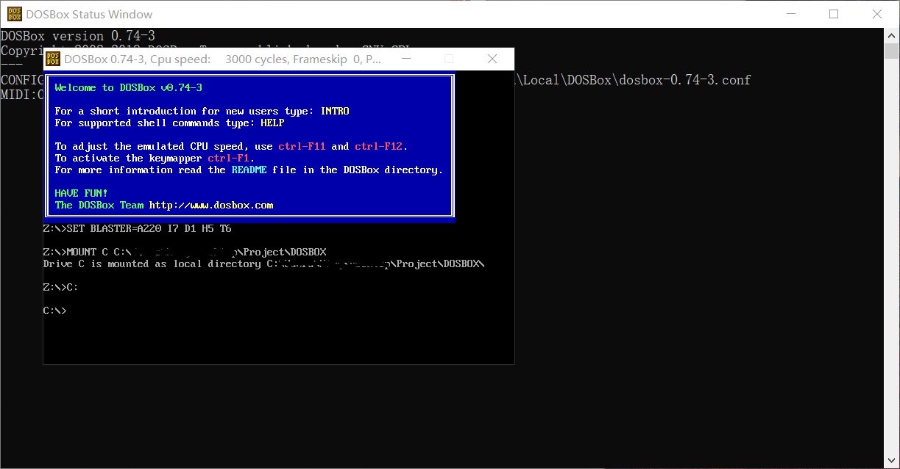
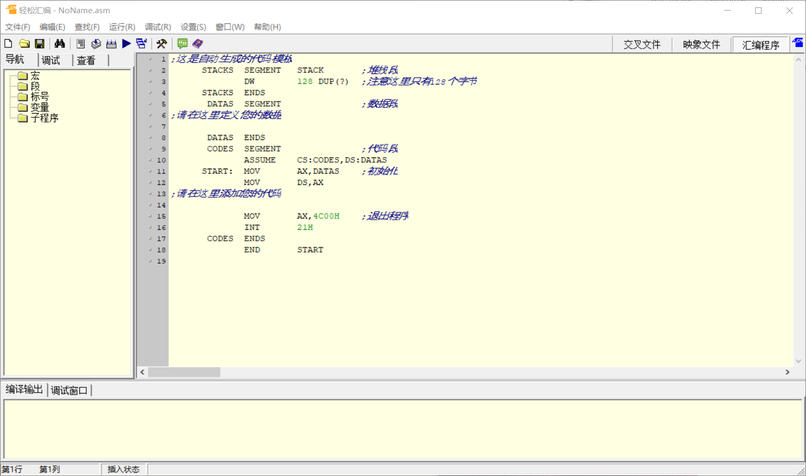

# assembly

## 1. code

|||
| -- | -- |
|01| [hello world](./src/01hello_world.asm)|

## 2. build the environment

### 2.1. masm32

[official website - masm32](http://www.masm32.com/)

### 2.2. DOSBox

[official website - DOSBox](https://www.dosbox.com/) 

[installation tutorial - cnblogs](https://www.cnblogs.com/liuzeyu12a/p/10285384.html) 

### 2.2.1. preview

### 2.3. QASM —— 轻松汇编

[download link - 华军软件园](http://mip.onlinedown.net/soft/24037.htm)

#### 2.3.1. preview

### 2.4. MASM for windows

### 2.5. MASMPlus

[official website - AoGo](http://www.aogosoft.com/masmplus/)

### 2.6. WASM

### 2.7. ASMStudio

### 2.8. Mars

### 2.9. PCSPIM

### 2.10. SASM

### 2.11. Visual Studio

[build tutorial](https://jingyan.baidu.com/article/e8cdb32be1940437042bad5c.html)
