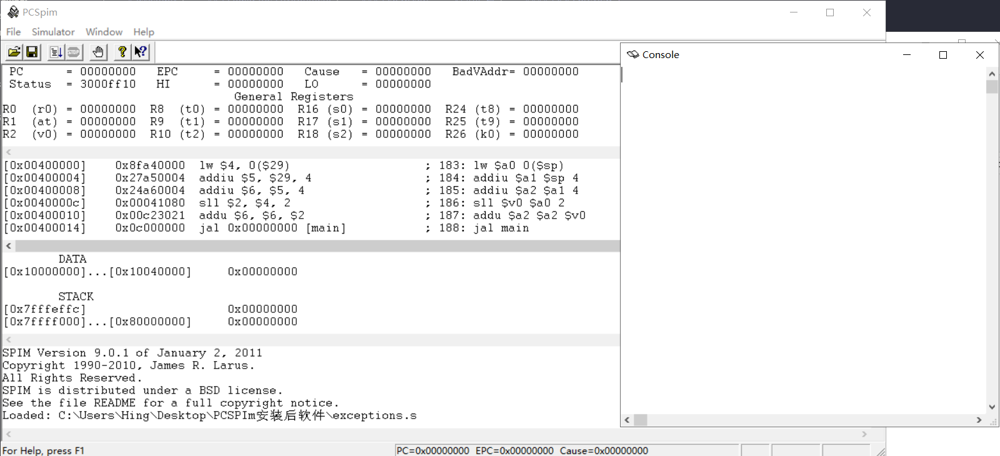

# assembly

## 1. Code

|||
| -- | -- |
|01| [hello world](./src/01hello_world.asm)|

## 2. Build the Environment

### 2.1. masm32

[Official Website - masm32](http://www.masm32.com/)

#### 2.1.1. preview

### 2.2. DOSBox

[Official Website - DOSBox](https://www.dosbox.com/) 

[Installation Tutorial - cnblogs](https://www.cnblogs.com/liuzeyu12a/p/10285384.html) 

#### 2.2.1. preview

### 2.3. QASM —— 轻松汇编

[Download Link - 华军软件园](http://mip.onlinedown.net/soft/24037.htm)

#### 2.3.1. preview

### 2.4. MASMPlus

[Official Website - AoGo](http://www.aogosoft.com/masmplus/)

#### 2.4.1. preview

### 2.5. MARS

[Official Website - AoGo](http://courses.missouristate.edu/kenvollmar/mars/)

[Installation Tutorial - CSDN](https://blog.csdn.net/y_universe/article/details/82875244)

#### 2.5.1. preview

### 2.6. PCSpim

[Download Link - sourceforge](http://spimsimulator.sourceforge.net/)

[Installation Tutorial - CSDN](https://blog.csdn.net/Kiloveyousmile/article/details/69055131)

#### 2.6.1. preview

### 2.7. SASM

[Official Website - Github](https://dman95.github.io/SASM/english.html)

#### 2.7.1. preview

### 2.8. MASM for windows

[Download Link - 腾讯软件中心](https://pc.qq.com/detail/0/detail_21540.html)

[Installation Tutorial - CSDN](https://blog.csdn.net/eastmount/article/details/8728280)

### 2.9. Visual Studio

[Build Tutorial](https://jingyan.baidu.com/article/e8cdb32be1940437042bad5c.html)

### 2.10. ASMStudio

[Download Link - CSDN](https://blog.csdn.net/weixin_34061555/article/details/86041383)

### 2.11. RadASM

[Installation Tutorial - CSDN](https://blog.csdn.net/weixin_30294709/article/details/94786972)
