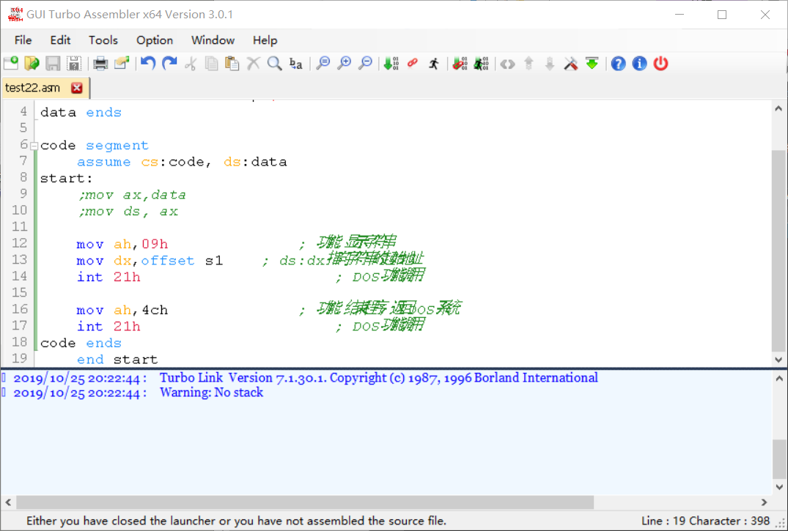

# Turbo Assembler

## preview

[Download Link - sourceforge](https://sourceforge.net/projects/guitasm8086/)

I found it on wikipedia.
It runs successfully on win10.
But the output interface is just a bit garbled
